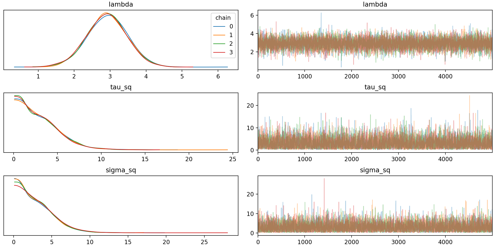
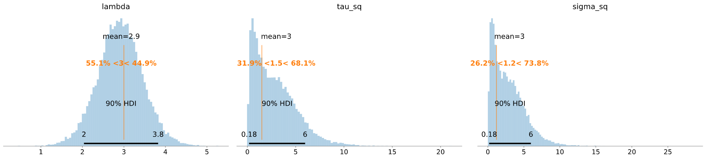
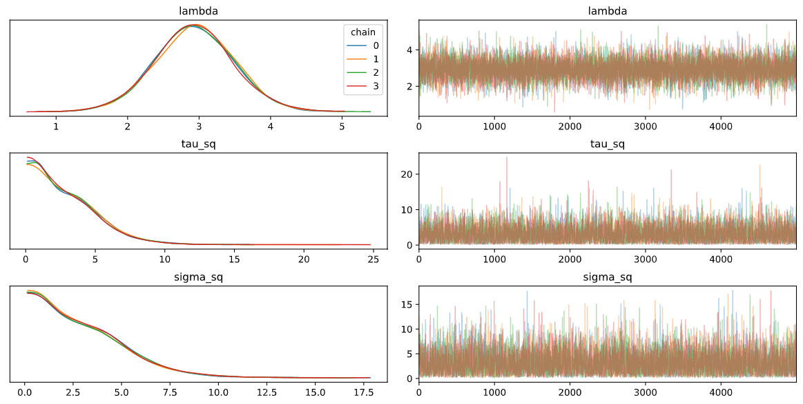
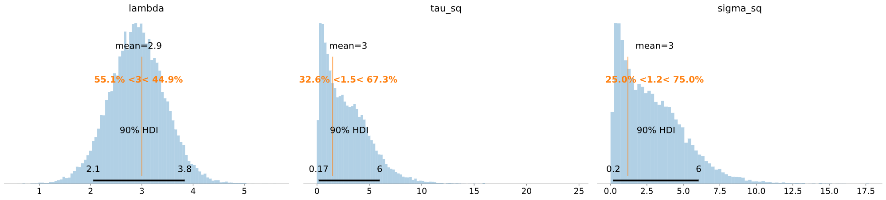

\newcommand{\var}{\mathrm{var}}
\newcommand{\indep}{\perp \!\!\! \perp}
\newcommand{\N}{{\mathcal N}}
\newcommand{\iid}{\overset {\text{iid}} {\sim}}
\newcommand{\IG}{\text{Inv-Gamma}}


```{r hnm-setup, include=FALSE}
knitr::opts_chunk$set(eval = FALSE, message = FALSE, warning = FALSE)
```

Stan, PyMC3 and NumPyro packages offer Hamiltonian Monte Carlo (HMC) and No-U-Turn Sampler (NUTS) for efficient MCMC sampling. In this example, the performance of NUTS algorithm in the three probabilistic programming packages will be evaluated with a simulation study. Firstly, The hierarchical model and data simulation will be articulated in Section \@ref(sec:hnm). Then, the process of model fitting and sampling in Stan(See Section \@ref(sec:hnm-stan)), PyMC3(See Section \@ref(sec:hnm-pymc3)) and NumPyro(See Section \@ref(sec:hnm-pyro)) will be streamlined. Concluding remarks will be raised in Section \@ref(sec:hnm-conclu).

## Hierachical Model{#sec:hnm}

From sampling perspective, the population of interest is divided into non-overlapping clusters, where $y_i$'s are observed value in cluster $i$ and $\mu_i$ are underlying cluster means. The [random effects model](https://en.wikipedia.org/wiki/Random_effects_model) is given by 

$$
\begin{equation}
y_i = \mu_i + \varepsilon_i 
(\#eq:rnd)
\end{equation}
$$
where the random effects $\mu_i \sim \N(\lambda, \tau^2)$ specifies the cluster means, and the random error term $\varepsilon_i \sim \N(0,1)$ is the deviation of observation from the cluster mean. The parameter of interest of this model is the underlying population mean ($\lambda$), the population variance ($\tau^2$) and the residual variance ($\sigma^2$).

To compensate the lack of independence of errors for observations within clusters, the equivalent model, which clarifies the hierarchical nature of the model, is given by:
$$
y_i \mid \mu_i \iid \N (\mu_i, \sigma^2),\quad i=1,\dots,N\\
\mu_i \mid \lambda,\tau \iid \N(\lambda, \tau^2),\quad  \sigma^2\sim \IG(1,1)\\
\lambda \sim \N(0, 100),\quad \tau^2 \sim \IG(1,1)\\
$$

($\mu_i, \sigma^2$) are parameters of the model and ($\lambda, \tau^2$) are hyperparameters. The rationale behind the choice of their distributions are:

* The weakly informative prior for $\lambda$ is adopted due to the lack of information of the population mean.

* The population variance ( $\tau^2$) and residual variance ( $\sigma^2$) are assumed to follow the Inverse Gamma distribution,which is a conjugate prior of a normal distribution with known mean.

In computing, the non-centered parameterization will be embraced to shift the correlation with the parameters to the hyperparameters and to improve the efficiency.

$$
\lambda = 10\cdot\tilde{\lambda}, \quad \tilde{\lambda} \sim \N (0,1)\\
\mu_i = \lambda + \tau\tilde{\mu_i},\quad\tilde{\mu_i} \sim \N(0,1)
$$

where $\tau\tilde{\mu_i}$ measures the deviation of cluster mean from the population mean.

On the other hand, assuming $\tilde{\mu_i} \indep \varepsilon_i$ the random effects model \@ref(eq:rnd) can be parameterized as follows
$$
y_i = \lambda + \tau \tilde{\mu_i} + \varepsilon_i
$$
This will yield $y_i \sim \N(\lambda, \tau^2+\sigma^2)$ such that the $\mu_i$ can be managed by specifying $\lambda$ and $\tau^2$ in programming.

The motivations and examples of reparameterization are discussed in the [Section 22.7](https://mc-stan.org/docs/2_23/stan-users-guide/reparameterization-section.html) of the Stan User's guide, and it also applies to PyMC3 and NumPyro cases.

### Data Simulation

The generated data are prepared as follows for the simulation study.

```{r hnm-data, eval=TRUE}
set.seed(42) # for reproducibility 
N <- 20 # number of clusters
true_lam <- 3 # true population mean
true_tau2 <- 1.5 # true cross -cluster variance
true_sig2 <- 1.2 # true inter-cluster variance 
true_mu <-true_lam + sqrt(true_tau2)*rnorm(N) # true cluster means
y <- true_mu + sqrt(true_sig2)*rnorm(N) # observed data input for models
```

To implement on the same data in R and Python, the observed y has been saved to the `data.txt`. Python can load the data with the following code for PyMC3 and NumPyro.

```{python hnm-data-load}
# Load the observations:
THIS_FOLDER = os.path.dirname(os.path.abspath(__file__))
data_file = os.path.join(THIS_FOLDER, 'data.txt')
d = open(data_file)
y = np.array([float(line.strip('\n')) for line in d.readlines()])
```


## Stan {#sec:hnm-stan}

This section will offer a step-by-step guide for estimating the parameters from the simulated data in Stan. Installation guidelines and useful online resources are listed:

* [Stan Installation Instructions](https://github.com/stan-dev/rstan/wiki/RStan-Getting-Started) provides a quick tutorial for downloading, installing, and getting started with Stan on all platforms.

* [Stan User's Guide](https://mc-stan.org/docs/2_22/stan-users-guide/index.html) is the official user’s guide for Stan and provides examples for coding statistical models in Stan. 

* [Stan Reference Manual](https://mc-stan.org/docs/2_23/reference-manual/index.html) specifies the programming language, inference algorithms and posterior analysis tools.

* [Stan Functions Reference](https://mc-stan.org/docs/2_23/functions-reference/index.html) provides a list of defined functions and distributions in the Stan math library and available in the Stan programming language.


### Stan Modelling language{#sec:hnm-stan-mod}

The hierarchical model can be translated into Stan modeling language.

```{r hnm-stan-file, echo = FALSE, eval=TRUE,results = "asis"}
cat("```stan", readLines("HierNorm.stan"), "```", sep = "\n")
```


The the model specified in the Stan modeling language can be complied with the `stan_model()` function in [rstan package](https://cran.r-project.org/web/packages/rstan/index.html) to construct a `stanmodel` object:

```{r hnm-stan-Setup, eval=TRUE}
require(rstan)
rstan_options(auto_write = TRUE)
# Compile the model
hnm_mod <- stan_model(file = "HierNorm.stan")
```

To ensure integrity, the Stan code shall be tested in the first place. For generic MCMC, checking that log-posterior is correct will suffice, which can be realized with `log_prob` in `rstan` package.

The stan model can be associated with the observations for log-posterior check by sampling for one iteration. For this purpose, the warnings produced by the `hnm_fit_init` can be ignored for now. 

```{r hnm-stan-init, eval=TRUE}
#  1. format data: 
#   list with elements named exactly as in the `data block in Stan
hnm_data <- list(N = N, y = y)
#  2. associate data with model:
#   MCMC sample for one iteration.
hnm_fit_init <- sampling(hnm_mod, data = hnm_data, iter = 1,
                         verbose = FALSE, chains = 1)
```

In R, the log-posterior are calculated with the `logpost` function defined below. This function will be referred to check the correctness of model in the other two packages as well. 

```{r hnm-lpR, eval = TRUE,code=xfun::read_utf8('logpost.R')}
```

With arbitrarily generated model parameters, it's expected that the R log-posterior and Stan log-posterior at these values differ by a constant. This constant is the summation of the constant additive terms of the log-posterior, which are dropped by default in Stan.

$$
\log\left(
\underbrace{(\frac{1}{\sqrt{2\pi}})^N}_{y_i \sim \N(\mu_i,\sigma^2)}
\cdot \underbrace{(\frac{1^1}{\Gamma(1)})^2}_{\sigma^2, \tau^2 \sim \IG(1,1)}
\cdot \underbrace{\frac{1}{\sqrt{2\pi}}}_{\lambda \sim \N(0,1)}
\right)
 = -(N+1)\log(\sqrt{2\pi})
$$

```{r hnm-stan-lpcheck, eval=TRUE}
# Simulate parameter values:
nsim <- 5 # number of simulations to conduct
# randomly generated parameter values to check the correctness
Pars <- replicate(n = nsim, expr = {
    list(lambda_tilda = rexp(1), 
         tau_sq = rexp(1)*5, sigma_sq = rexp(1)*2)
}, simplify = FALSE)

# log-posterior calculation in R:
lpR <- sapply(1:nsim, function(ii) {
  lambda_tilda <- Pars[[ii]]$lambda_tilda
  tau_sq <- Pars[[ii]]$tau_sq
  sigma_sq <- Pars[[ii]]$sigma_sq
  logpost(lambda_tilda = lambda_tilda,
          tau_sq = tau_sq, sigma_sq = sigma_sq, y = hnm_data$y)
})

# log-posterior calculation in Stan:
lpStan <- sapply(1:nsim, function(ii) {
  upars <- unconstrain_pars(object = hnm_fit_init, Pars[[ii]])
  log_prob(object = hnm_fit_init, upars = upars, adjust_transform = FALSE)
})

lpR-lpStan # return exactly same constant

-(N+1)*log(sqrt(2*pi)) # Theoretical difference
```

### MCMC Sampling

The NUTS sampling are implemented to make parameter inference.
```{r hnm-stan-sampling}
nsamples <- 1e4 # number of total iterations
start_time <- Sys.time()# To measure the running time
# Sampling:
hnm_fit <- sampling(hnm_mod, data = hnm_data, iter = nsamples,
                      control = list(adapt_delta = 0.99))
end_time <- Sys.time()
# wall time of NUTS sampling 
stan_time <- end_time - start_time 
# extract MCMC samples
hnm_post <- extract(hnm_fit)
```

In this step, the `hnm_fit` would give some of preruntime warnings and runtime warnings that can be managed by adjusting control factor. Instructions to handle with these warnings are provided in this [warning guide](https://mc-stan.org/misc/warnings.html).  With proper adjustments, it takes around 3 ~ 4 seconds to complete the sampling process.  
 

```{r hnm-postdata-load, echo=FALSE, eval=TRUE}
#saveRDS(list(hnm_fit= hnm_fit, stan_time = stan_time), file = "hnm_post.rds")
require(rstan)
hnm_mcmc <- readRDS('hnm_post.rds')
hnm_fit <- hnm_mcmc$hnm_fit # MCMC samples
hnm_post <- extract(hnm_fit)
rm(hnm_mcmc)
```


### Diagnostic

Both the density plot and trace plot in Figure \@ref(fig:hnm-stan-trace) evidence that the chains completely overlap with each other and the MCMC has converged.

```{r hnm-stan-trace, eval=TRUE, fig.width=10, fig.height=4,fig.cap='Density plot and trace plot per parameter per chain from MCMC samples by Stan'}
theta <- c("lambda","tau_sq","sigma_sq")
trace <- stan_trace(hnm_fit, pars = theta, ncol = 1) # trace plot 
dens <- stan_dens(hnm_fit, pars = theta, separate_chains = TRUE, ncol = 1) #kernel density estimates
gridExtra::grid.arrange(dens,trace, ncol = 2) # arrange the plots
```

The summary statistics of chain-merged posterior samples per parameter are produced. The mean posterior estimate of population mean $\lambda$ are close to the true value while that of the other parameter bias from the true values. 
```{r hnm-stan-summ, eval=TRUE}
# selected posterior summaries for each of the parameters:
summary(hnm_fit, pars= theta)$summary[,c(1,3,9,10)]
```
The posterior density with 90% credible interval are displayed. 
```{r hnm-stan-post, eval=TRUE, fig.width=10, fig.height=4, fig.cap="Posterior density per parameter with means and 90% credible interval by Stan"}
require(bayesplot)
color_scheme_set(scheme = "mix-teal-blue") #(Optional) set a color scheme for the plots
theta_post <- as.matrix(hnm_fit)
bayesplot_grid(plots =lapply(theta, function(x) 
  mcmc_areas(theta_post, pars = x, point_est = 'mean', prob = 0.90)),
  subtitles = theta,
  grid_args = list(nrow = 1)) 

```


## PyMC3 {#sec:hnm-pymc3}

This section will walk through the model building and fitting process by using the PyMC3 package. Installation, tutorials and examples are provided on the [PyMC3 website](https://docs.pymc.io).

The intact code snippet can be found in Section \@ref(sec:hnm-pymc3code) and packages used are listed below:

```{python hnm-pymc3-load}
import pymc3 as pm 
import numpy as np
import matplotlib.pyplot as plt
import arviz as az
import os
```

### Create Model

The `with` statement will create a context manager, where the `hnm_mod` is the context, such that all objects or variables introduced in the indented code block will be associated to the model object.

```{python hnm-pymc3-mod}
with pm.Model() as hnm_mod:  
  # hyper-priors:
  lam_tilde = pm.Normal('lambda_tilde', mu=0, sigma=1)
  # implies lambda ~ N(0,sd =10)
  lam = pm.Deterministic('lambda', 10 * lam_tilde)
  tau_sq = pm.InverseGamma('tau_sq', alpha= 1.0 , beta= 1.0)
  # prior:
  sigma_sq = pm.InverseGamma('sigma_sq', alpha=1.0, beta=1.0)
  # Likelihood:
  y_sd = pm.Deterministic('y_sd', np.sqrt(sigma_sq + tau_sq))
  L = pm.Normal('Likelihood', lam, sigma= y_sd, observed=y)
```

For efficient MCMC sampling, PyMC3 will automatically transform constrained continuous variables to unconstrained scale The [transforms.log](https://docs.pymc.io/api/distributions/transforms.html#pymc3.distributions.transforms.Transform) is implemented to the positive variables $\tau^2$ and $\sigma^2$. This can be further confirmed by checking with the attribute `hnm_mod.vars`, where modified variable names is `tau_sq_log__` and `sigma_sq_log__` instead of `tau_sq` and `sigma_sq`. It's not recommended to set `transformation = None` in the constrained variables; if the transformation were deserted, warnings or divergence would deter the sampling process.

To check the correctness of the model in PyMC3, the log-posterior are checked against that in R at the same parameter values. It's been validated that the log-posterior in PyMC3 using `log_nojac` will produce the same value as in R using `logpost()`. 

```{python hnm-pymc3-lpcheck}
# Example code for log-posterior 
hnm_mod.vars # free variables in the model
# log-posterior
logp_nojac = hnm_mod.logp_nojac 
print(logp_nojac({'lambda_tilda': 1, 'tau_sq_log__': np.log(5), 'sigma_sq_log__': np.log(4)}))
```

Note that `logp` will return log posterior of the model including the Jacobian terms of transformed variables. However, the Jacobian of the transformation are required when using different parameterizations for the same distribution. The the transformation of $\tau^2$ and $\sigma^2$ makes the estimates invariant with respect to the parameterization and the Jacobian term shall be excluded from log posteriors. This can be checked with the following code such that the difference will agree with the Jacobian terms.

```{python hnm-pymc3-jacobian}
# e.g. lam_tilde = 1; tau_sq = 5, sigma_sq = 4
# log-posterior including log of jacobian determinants of transformed variables
logp = hnm_mod.logp 
print(logp({'lambda_tilda': 1, 'tau_sq_log__': np.log(5), 'sigma_sq_log__': np.log(4)}))
np.log(5) + np.log(4) # Jacobian terms = difference between logp and logp_nojac
```

Details of `logp_nojac` and `logp` method can be found in the [PyMC3 developer guide](https://docs.pymc.io/developer_guide.html)

### MCMC Sampling

Different from the Stan, PyMC3 will assign draws and warm-up draws separately. To be consistent with the sampling in Stan, `draws` and `tune` are assigned to half of the number of samplers. 

```{python hnm-pymc3-nuts}
# Model fitting: 
#   target_accept and chains are assigned to keep consistency with Stan code.
nsamples = 1e4
with hnm_mod:
  trace_hnm = pm.sample(draws= nsamples/2, tune=nsamples/2, target_accept=0.99, chains=4, cores=1)
```

It takes around 80~90 seconds to complete the sampling process.

### Diagnostic 

[PyMC3 ploting](https://docs.pymc.io/api/plots.html) provides visualization tools in PyMC3 packages, where plots are delegated to the [ArviZ libaray](https://arviz-devs.github.io/arviz/). The trace plot and the posterior plot in this section will be produced with ArviZ methods, while the alternatives in PyMC3 will be provided in code comment. 

Both the density plot and trace plot in Figure \@ref(fig:hnm-pymc3-trace-p) evidence that the chains completely overlap with each other and the MCMC has converged.

```{python hnm-pymc3-trace}
# Alternative: pm.traceplot()
with hnm_mod:
  az.plot_trace(trace_hnm, var_names = ["lambda", "tau_sq", "sigma_sq"], legend=True)
  plt.show()
```

```{r hnm-pymc3-trace-p, eval=TRUE, echo=FALSE, fig.width=10, fig.height=4, fig.cap='Density plot and trace plot per parameter by chains from MCMC samples by PyMC3'}

```

The posterior density with 90% credible interval are displayed:

```{python hnm-pymc3-post}
# Alternative: pm.plot_posterior()
with hnm_mod:
  az.plot_posterior(trace_hnm, var_names = ["lambda", "tau_sq", "sigma_sq"], kind='hist', point_estimate='mean', 
    ref_val=[true_lam, true_tau2, true_sig2], hdi_prob= 0.90)
  plt.show()
```

```{r hnm-pymc3-post-p, eval=TRUE, echo=FALSE, fig.width=10, fig.height=4, fig.cap=' Posterior per parameter with means and 90% credible interval by PyMC3: the orange line is the true parameter value'}

```

### Intact Code Snippet{#sec:hnm-pymc3code}


```{python hnm-pymc3-code, code = xfun::read_utf8('hnm_pymc3.py')}
```

## NumPyro {#sec:hnm-pyro}

This section will implement the MCMC sampling with NumPyro packages, 

* [Pyro project on NumPy](https://pypi.org/project/numpyro/) provides installation guide and examples.

* [NumPyro documentation](http://num.pyro.ai/en/stable/#) lists defined functions and distributions.

* [NumPyro Tutorials](http://pyro.ai/numpyro/index.html) offers several code examples.

The intact code snippet can be found in Section \@ref(sec:hnm-pyrocode) and the packages used in this example are listed below:

```{python hnm-pyro-pkg}
import numpyro as po 
import numpyro.distributions as dist
from numpyro.infer import MCMC, NUTS, util
from jax import random
import jax.numpy as np
import timeit

import matplotlib.pyplot as plt
import arviz as az
import os
```

### Build the Model 

In NumPyro, the model code can be any Python callable. The `sample` primitive draws a random sample from the stochastic function specified. 

```{python hnm-pyro-mod}
def hnm_mod(N, y = None):
    """ Estimate the posterior estiamtes of the hierarchical model given below:
        y_i | mu_i, sigma_sq ~ N(mu_i, var = sigma_sq)
        mu_i ~ N(lambda, var = tau_sq)
        lambda ~ N(0,var = 100)
        sigma_sq, tau_sq ~ Inverse-Gamma(1,1)

    By taking reparameterization, it's equivalent to 
        lam_tilde ~ N(0,1), lambda = 10*lam_tilde
        tau_sq, sigma_sq ~ Inverse-Gamma(1,1)
        y_sd = sqrt(tau_sq + sigma_sq)
        y ~ N(lambda, y_sd)

    Args:
        N (int): the length of y
        y (array): the observed y

    Returns:
        Float: Prediction of y by the model 
    """
    # hyper-prior
    lam_tilde = po.sample('lam_tilde', dist.Normal(0., 1.))
    lam = po.deterministic('lambda', 10*lam_tilde)
    tau_sq = po.sample('tau_sq', dist.InverseGamma(concentration=1,rate=1))
    # prior
    sigma_sq = po.sample('sigma_sq', dist.InverseGamma(concentration=1, rate=1))
    # Likelihood
    # `plate` is a context manager: 
    #   constructed for annotating conditionally independent observations y.
    with po.plate("N", N):
        y_sd = po.deterministic('y_sd', np.sqrt(sigma_sq + tau_sq))
        po.sample('Likelihood', dist.Normal(loc=lam, scale=y_sd), obs=y)
```

Note that the rate parameter in the inverse gamma distribution is actually corresponding to the scale parameter in the [literatures](https://en.wikipedia.org/wiki/Inverse-gamma_distribution).

`log_density` method will return the log-posterior of the model at given parameter values and can be applied to investigate the log-posterior against in R. The model has been convinced by random sets of parameter values. The example code is given by:

```{python hnm-pyro-lpcheck}
# e.g. lam_tilde = 1.8; tau_sq = 4.6, sigma_sq = 4
#  the log_density function will return 
#     1. the log posterior values at the given parameter values
#     2. and a corresponding model trace
log_prob = util.log_density(hnm_mod, model_args=(), model_kwargs={'N':N,'y':y},
params={'lam_tilde':1.8,'tau_sq':4.6, 'sigma_sq':4.})
print(log_prob[0])
```


### MCMC Sampling

The sampling in NumPyro are completed by the following steps:

1. Assign the NUTS sampler to MCMC

2. Provide access to MCMC inference algorithms in NumPyro.

3. Run the NUTS sampler with a specified random number generator key.

```{python hnm-pyro-nuts}
# MCMC sampling:
nuts_kernel = NUTS(hnm_mod, target_accept_prob=0.99) # Assign sampler to MCMC
mcmc = MCMC(nuts_kernel, num_warmup = 5000, num_samples=5000, num_chains=4) # Access to MCMC
rng_key = random.PRNGKey(123) #Random number generator key to be used for sampling
mcmc.run(rng_key, N=N, y = y) #run the NUTS sampler and collect the samples
post_sample = mcmc.get_samples(group_by_chain=True) # Extrace the samples and separate by chains
```

It takes around 10 ~ 15 seconds to complete the process.

### Diagnostic

Same as with PyMC3, the ArviZ method will be applied for visualization.

```{python hnm-pyro-trace}
az.plot_trace(post_sample, var_names=['lambda', 'tau_sq', 'sigma_sq'],combined=False, legend=True)
```

```{r hnm-pyro-trace-p, eval=TRUE, echo=FALSE, fig.width=10, fig.height=4, fig.cap='Density plot and trace plot per parameter by chains from MCMC samples by NumPyro'}

```

Both the density plot and trace plot in Figure \@ref(fig:hnm-pyro-trace-p) evidence that the chains completely overlap with each other and the MCMC has converged.

The posterior density with 90% credible interval are displayed:

```{python hnm-pyro-post}
az.plot_posterior(post_sample, var_names=['lambda', 'tau_sq', 'sigma_sq'], kind='hist', point_estimate='mean', ref_val=[true_lam, true_tau2, true_sig2], hdi_prob=0.90)
```

```{r hnm-pyro-post-p, eval=TRUE, echo=FALSE, fig.width=10, fig.height=4, fig.cap='Posterior per parameter with means and 90% credible interval by by NumPyro: the orange line is the true parameter value'}

```

### Intact Code Snippet{#sec:hnm-pyrocode}


```{python hnm-pyro-code, code = xfun::read_utf8('hnm_pyro.py')}

```

## Conclusion {#sec:hnm-conclu}

The performance of the trace plots and posterior statistics by the three probabilistic programming packages are analogous. In terms of timing, Stan is the most efficient one who completes the sampling process for this example within 5 seconds on my computer. NumPyro, taking around 10 seconds, marks the second place. It would take PyMC3 almost 20 times longer than Stan. 


